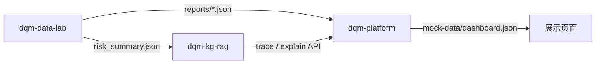

# 0_ 自研最小项目集

本目录统一存放 3 个最小可交付自研项目，支撑“数据治理 → 知识图谱/RAG → 平台展示”的最小闭环。

## 项目信息

| 项目 | 对应核心工作 | 主要职责 | 技术栈 |
|---|---|---|---|
| [`dqm-data-lab`](./dqm-data-lab/) | 工作一：质量数据可信治理与评价 | 多模态数据接入、治理、评价、基础风险输出 | Python、pandas、scikit-learn、pydantic |
| [`dqm-kg-rag`](./dqm-kg-rag/) | 工作二：质控知识图谱与根因追溯 | 三元组导入、图谱追溯、轻量 GraphRAG API | Python、FastAPI、pydantic |
| [`dqm-platform`](./dqm-platform/) | 工作三展示与总平台 | 前端展示、聚合 API、风险预测与智能体 mock | React、Vite、TypeScript、FastAPI |

## 启动方式

### 0. 一键全流程分析（推荐）

当前优先选择 `datasets/01_tabular_secom` 作为全流程样例。原因：

- 与元器件/半导体制造质量高度相关。
- 具备高维工艺特征、缺失值和 pass/fail 标签，适合验证数据治理、异常检测和特征筛选。
- 可自然映射到“制造过程波动、设备状态漂移、批次一致性下降”等质控知识图谱节点。

```powershell
cd projects/0_
python run_full_flow.py
```

该命令会依次执行：

1. `dqm-data-lab`：读取 SECOM，输出数据治理报告和风险摘要。
2. `dqm-data-lab`：补充 SECOM 分类指标、DTW 相似片段、趋势摘要；若本地存在 C-MAPSS，则补充简化 RUL 曲线。
3. `dqm-kg-rag`：把关键异常特征映射为质量现象，执行图谱追溯和 RAG 解释。
4. `dqm-platform`：生成智能体协同、处置报告、反馈评价，并刷新 `mock-data/dashboard.json`。

输出：

- `outputs/secom_full_flow/data_lab/data_quality_report.json`
- `outputs/secom_full_flow/data_lab/risk_summary.json`
- `outputs/secom_full_flow/cmapss/risk_summary.json`（本地存在 C-MAPSS 时）
- `outputs/secom_full_flow/kg_workflow.json`
- `outputs/secom_full_flow/dashboard.json`
- `dqm-platform/mock-data/dashboard.json`

最终演示链路：

```text
数据治理 → 风险预测 → 根因追溯 → 智能体处置 → 反馈评价
```

### 1. 数据治理实验

```powershell
cd projects/0_/dqm-data-lab
python -m venv .venv
.\.venv\Scripts\Activate.ps1
pip install -e .
python -m dqm_data_lab run --dataset ../../../datasets/01_tabular_secom --out reports
```

输出：

- `reports/data_quality_report.json`
- `reports/risk_summary.json`

### 2. 知识图谱与 RAG 服务

```powershell
cd projects/0_/dqm-kg-rag
python -m venv .venv
.\.venv\Scripts\Activate.ps1
pip install -e .
uvicorn dqm_kg_rag.api:app --reload --port 8010
```

接口：

- `GET /health`
- `GET /graph`
- `GET /ontology`
- `GET /validate`
- `POST /trace`
- `POST /explain`
- `POST /workflow`

### 3. 平台 API

```powershell
cd projects/0_/dqm-platform/apps/api
python -m venv .venv
.\.venv\Scripts\Activate.ps1
pip install -r requirements.txt
uvicorn main:app --reload --port 8020
```

接口：

- `GET /health`
- `GET /dashboard`
- `GET /dashboard/{section_name}`
- `GET /workflow`

### 4. 平台前端（演示页面）

**访问地址：http://127.0.0.1:5173**

| 页面 | 路径 | 功能 |
|------|------|------|
| 总览 | `/` | Dashboard 全流程结果 |
| 数据导入 | `/import` | 上传文件 + 选择模态/对象/用途 |
| 知识图谱 | `/graph` | 图数据库可视化 + 根因追溯 |
| Agent 协同 | `/agent` | LangGraph 对话 + 实时数据模拟 |

一键启动（API + 前端）：

```powershell
cd projects/0_/dqm-platform
.\start.ps1
```

或仅启动前端：

```powershell
cd projects/0_/dqm-platform/apps/web
npm install
npm run dev
```

建议先运行 `python run_full_flow.py` 刷新演示数据，再打开页面。

## 数据流



