# 申报书技术方案（第四章索引）

> **权威来源**：`资料/申报书正文-西工大部分-提交.pdf` → **四、技术方案**  
> **用途**：本项目工作划分、文档命名、阶段规划均以本章为准；六域 A–F 为辅助学习分层。  
> **技术方案插图**：[`资料/img/`](../资料/img/README.md)（图1–图18，已按内容重命名）  
> 更新日期：2026-06-14

---

## 1. 总体结构（两大部分）

申报书 **（一）总体技术方案** 仅含 **2 个一级技术方案**，对应你要完成的两大块工作：

| 一级编号 | 全称（申报书原文） | 简称 |
|----------|-------------------|------|
| **§1** | 电子信息装备多维度质量数据标准与系列化产品质量管控数据治理方法**技术方案** | **数据标准与治理技术方案** |
| **§2** | 电子信息装备智能化质量风险识别、反馈与响应**技术方案** | **风险识别与响应技术方案** |

> **勿用**已废弃的「数据类 / 检测类 / 平台」三分法组织任务；平台集成在 **§2.5**，不是与 §1、§2 并列的第三块。

---

## 2. 完整章节树

### §1 数据标准与治理技术方案

| 编号 | 章节标题 |
|------|----------|
| **1.1** | 电子信息装备多维度质量数据标准体系构建方法 |
| 1.1.1 | 电子信息装备质量管理流程及数据规范分析 |
| 1.1.2 | 电子信息装备质量数据标准规范分析 |
| **1.2** | 电子信息装备多模态质量数据综合治理及数据质量增强方法 |
| 1.2.1 | 基于异构质量数据差异化表征的…多模态质量数据综合治理技术体系构建 |
| 1.2.2 | 多变量时间序列缺失装备质量数据补全与不确定性量化方法 |
| 1.2.3 | 基于时空扩散的低秩自适应装备质量管控多模态数据补全技术 |
| **1.3** | 电子信息装备质量数据评价方法研究 |
| 1.3.1 | 基于灰色关联分析-证据融合…质量数据评价指标体系构建 |
| 1.3.2 | 基于 Lasso 特征提取的模糊综合…质量数据评价方法 |

**对应关键技术**：关键技术 2（多模态质量数据综合治理技术体系构建）

### §2 风险识别与响应技术方案

| 编号 | 章节标题 |
|------|----------|
| **2.1** | 电子信息装备质控知识图谱构建及知识驱动的质量管控方法 |
| 2.1.1 | 基于多源异构质量数据融合的…质量管控知识图谱构建 |
| 2.1.2 | 基于质控知识图谱的电子信息装备差异化质量管控技术 |
| **2.2** | 电子信息装备质量问题发现及潜在风险预测技术研究 |
| 2.2.1 | 基于质量管控知识图谱的电子信息装备质量风险识别方法 |
| 2.2.2 | 基于机器学习的电子信息装备质量风险检测分析方法 |
| 2.2.3 | 基于大模型及检索增强生成（RAG）的电子信息装备潜在质量风险预测技术 |
| **2.3** | 针对整机、软件和元器件三类模式构建质量管控智能体 |
| 2.3.1 | 基于质量指标动态分解的三类质量管控智能体协同机制研究 |
| 2.3.2 | 基于质量指标分解、全局决策共享的整机质量管控智能体构建技术 |
| 2.3.3 | 基于耦合稳定、风险可溯软件质量管控智能体构建技术 |
| 2.3.4 | 基于质量可控、机理可释的元器件质量管控智能体技术 |
| **2.4** | 电子信息装备质量风险反馈响应效果评测技术研究 |
| **2.5** | 电子信息装备质量管控智能决策管理平台研发 |

**对应关系**：

| 章节 | 关键技术 / 创新点 |
|------|-------------------|
| 2.1.2 | **创新点 1**（质控知识图谱差异化管控） |
| 2.2.3 | **创新点 2**（大模型+知识驱动潜在风险预测） |
| 2.3 | **关键技术 1**（群智决策 + 三类智能体协同） |

---

## 3. 六域 A–F 与第四章对照（辅助学习用）

| 六域 | 专业名称 | 主要对应第四章 |
|------|----------|----------------|
| **A** | 质量数据标准化与语义互操作 | **§1.1**（1.1.1–1.1.2） |
| **B** | 多模态质量数据工程与治理 | **§1.2**（1.2.1–1.2.3） |
| **C** | 质量度量与多准则评估 | **§1.3**（1.3.1–1.3.2） |
| **D** | 质量知识工程与图谱驱动管控 | **§2.1**（2.1.1–2.1.2） |
| **E** | 预测性质量分析与智能决策 | **§2.2**（2.2.1–2.2.3） |
| **F** | 闭环 QMS 平台与多智能体协同 | **§2.3–§2.5** |

**应用对象维度**（整机 / 软件 / 元器件）贯穿 §2.3，**不是**与 §1、§2 并列的技术分层。

---

## 4. 三项实验与第四章对照

| 实验 | 对应第四章 | 对应关键/创新 |
|------|------------|---------------|
| 实验一：多模态数据可信治理 | **§1 全部**（1.1 + 1.2 + 1.3） | 关键技术 2 |
| 实验二：图谱差异化管控 | **§2.1** | 创新点 1 |
| 实验三：风险预测与多智能体 | **§2.2 + §2.3 + §2.4**（平台落地见 §2.5） | 创新点 2 + 关键技术 1 |

---

## 5. 平台与闭环表述（§2.5）

申报书 **2.5** 平台采用 **六层** 体系（见图18）：感知层 → 治理层 → 垂类模型层 → 智能体层 → 风险分析层 → 应用层；与下文「感知—治理—知识—应用」四层表述兼容，六层为申报书原图细化版本。

闭环流程（申报书多次出现）：

```
质量数据汇聚 → 质控知识图谱构建 → 质量风险检测 → 质量风险智能分析
→ 质量问题协同处置 → 装备质量持续优化
```

---

## 6. 命名规范（写文档时请遵守）

| 推荐 | 避免 |
|------|------|
| §1 / §2、1.2.1、2.3.2 | 「数据类」「检测类」 |
| 整机 / 软件 / 元器件质量管控智能体 | 知识检索型 / 分析型 / 决策辅助型（非申报书三类） |
| 系统质量管控智能体 = **软件**质量管控智能体 | 把「系统」理解成硬件子系统 |
| 质量风险**检测分析**（2.2.2） | 笼统「检测类」 |
| 质控**知识图谱**（2.1） | 与「知识库」混为一谈（知识库含 Neo4j+MySQL+FastDFS） |

---

## 8. 技术方案插图（图1–图18）

> 插图目录：[`资料/img/`](../资料/img/README.md) | 命名规则：`编号_内容.jpeg`

### §1 数据标准与治理

#### 图1 · 质控数据标准与治理技术路线图（§1 总览）


四段式主线：**质控数据源**（新型雷达 / 迭代增量式软件 / 基础元器件）→ **质控数据规范**（术语、分类编码、格式交换 + 采集/存储/通信标准）→ **质控数据治理及增强**（均值方差特征筛选、Z-score 标准化、软阈值滑动窗口异常检测、多模态智能标注；缺失补全与时空扩散图像补全）→ **质控数据评价**（灰色关联-证据融合指标体系 + Lasso-FCE 评价模型）。评价结果可反馈至数据增强环节，形成闭环。

#### 图2 · 多变量时序列缺失补全与不确定性量化（§1.2.2）


三级流水线：**级别1 特征增强**（连续小波变换多尺度分解 + 动态注意力时序加权）→ **级别2 鲁棒补全**（扩散模型前向/逆向过程约束分布 + GAN 生成器/判别器 + CT-MLP 对比损失）→ **级别3 不确定性量化**（深度度量学习三元组嵌入 + 共形预测校准，输出带 **95% 置信区间** 的补全序列）。

#### 图3 · 时空扩散多模态数据预测（§1.2.3）


双路编码：**ViT-MAE** 提取图像/波形静态特征，**MCE** 编码气象/工况表格特征；经 **Neural SDE**（漂移项 + 扩散项）建模时序演化；**SVD-U-Net + LoRA** 解码生成预测结果。对应申报书「编码—演化—解码」三阶段与神经随机微分方程表述。

#### 图4 · Lasso 模糊综合质量数据评估（§1.3.2）

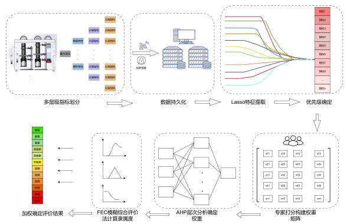

流程：多层级指标划分（数据/硬件/计划/分层指标）→ 数据持久化与加载传输 → **Lasso 特征提取** 确定指标优先级 → 专家打分构建权重矩阵 → **AHP** 定权 → **FCE 模糊综合评价** 计算隶属度 → 加权输出健康/亚健康/故障/失效等等级。

### §2 风险识别与响应

#### 图5 · 智能化质量风险识别、反馈与响应技术路线（§2 总览）

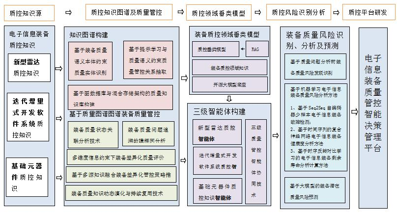

五段主线：**质控知识源**（雷达/软件/元器件质控知识）→ **质控知识图谱及质量管控**（本体约束 NER、提示学习关系抽取、混合存储知识库；状态关联、根因追溯、差异化评价与策略推荐）→ **质控领域垂类模型**（开源大模型 + 领域知识 + RAG + 三级智能体）→ **风险识别/检测/预测**（质量问题分析树、Seq2Seq/CNN-LSTM/对比学习 RUL、大模型预测）→ **智能决策管理平台**。

#### 图6 · 知识图谱命名实体识别（§2.1.1）

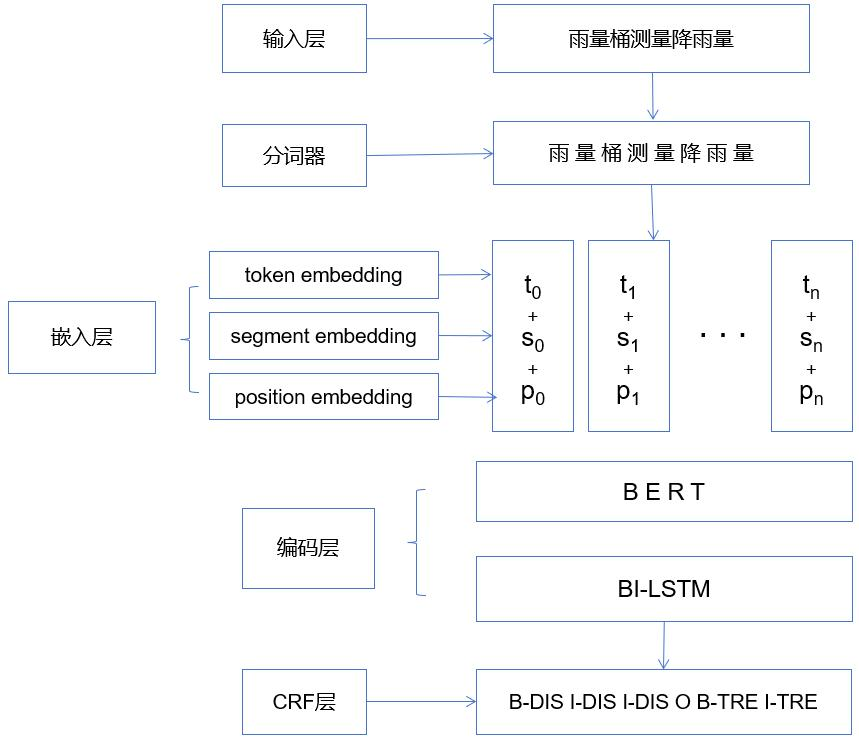

输入文本经分词后，**token + segment + position** 三类嵌入求和 → **BERT** 编码 → **BiLSTM** 捕获双向序列依赖 → **CRF** 输出 BIO 标注序列（如 B-DIS / I-DIS / O 等实体标签）。

#### 图7 · 知识图谱关系抽取（§2.1.1）

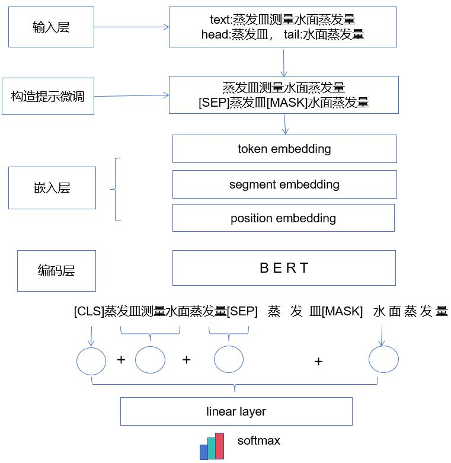

基于 **Prompt Tuning**：将 head/tail 实体嵌入提示模板（`[SEP] head [MASK] tail`），经 BERT 编码后取 **[CLS]** 与 **[MASK]** 位置表示，线性层 + Softmax 判定关系类型。适用于质控三元组「装备—导致—故障」等关系抽取。

#### 图8 · 质量问题分析树（§2.2.1）

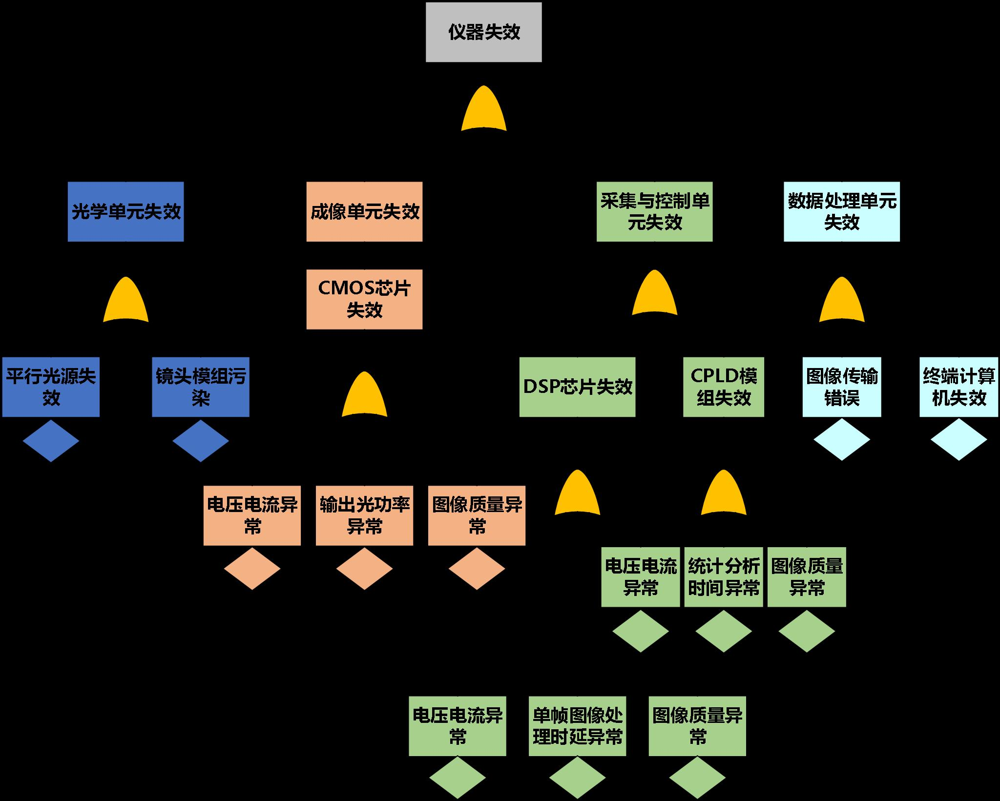

以「仪器失效」为顶事件，按 **光学单元 / 成像单元 / 采集与控制单元 / 数据处理单元** 四层 OR 门分解；叶节点为可观测异常（电压电流异常、光功率异常、图像质量异常、处理时延异常等）。申报书示例为元器件级质量问题树，工程实现需替换为雷达/软件/元器件领域实体。

#### 图9 · Seq2Seq 自编码器少样本故障检测（§2.2.2）

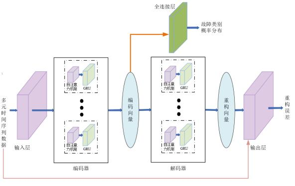

多元时序 → **自注意力 + GRU** 编码器 → 编码向量分两路：**全连接层** 输出故障类别概率（监督分支）；**解码器** 重构输入，以重构误差辅助异常检测（无监督分支）。对应申报书「基于自注意力增强的 GRU 的 Seq2Seq 自编码器」。

#### 图10 · 格拉姆角场卷积特征提取（§2.2.2）

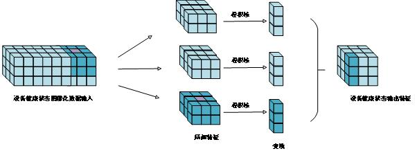

设备健康状态**图像化**输入 → 多路 **卷积核** 提取局部特征 → 变换聚合为输出特征图。用于将一维时序（GAF/MTF 等）转为 CNN 可处理的二维表示，支撑健康度分析。

#### 图11 · 时序反转对比学习 RUL 预测（§2.2.2）

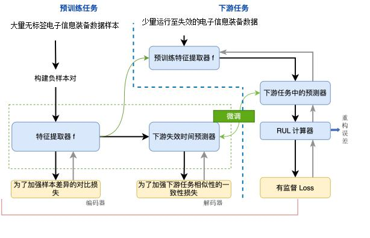

**预训练**：大量无标签装备样本，时序反转构造负样本对，共享编码器最小化对比损失。**下游**：少量运行至失效样本，预训练编码器 + 失效时间预测解码器，联合一致性损失与有监督 Loss，经 RUL 计算器输出剩余寿命。

#### 图12 · 装备质控领域垂类模型（§2.2.3）

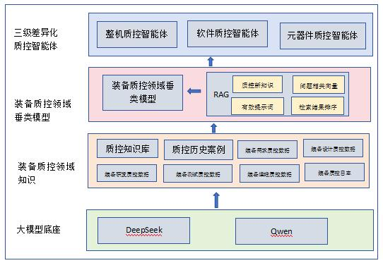

自下而上：**大模型底座**（DeepSeek / Qwen）→ **装备质控领域知识**（知识库、历史案例、全生命周期质控数据）→ **垂类模型 + RAG**（新知识、问题向量、提示词、检索排序）→ **三级差异化质控智能体**（整机 / 软件 / 元器件）。

#### 图13 · 大模型潜在质量风险预测（§2.2.3，创新点2）

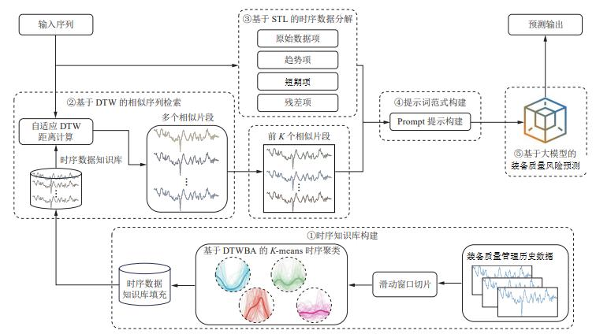

五步流程：① 历史数据滑动窗口切片 + **DTWBA-K-means** 填充时序知识库 → ② 输入序列 **DTW 相似片段检索**（Top-K）→ ③ **STL 分解**（趋势/周期/残差）→ ④ 融合构建 Prompt → ⑤ 大模型输出风险预测。对应创新点2「先验知识注入提示词 + 时序知识检索」。

### §2.3–§2.5 智能体与平台

#### 图14 · 三类质量管控智能体协同机制（§2.3.1，关键技术1）

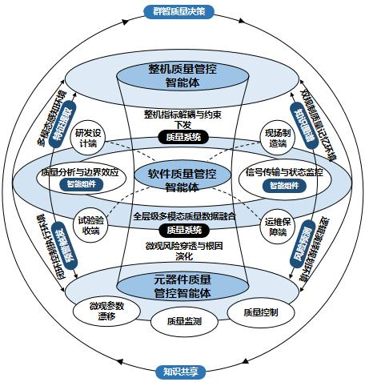

全层级架构：中心为整机 / 软件 / 元器件三级智能体；外环为研发设计、现场制造、试验验收、运维保障四端；四个环境象限分别承载特征提取、知识图谱、风险预测、预警触发；顶部 **群智质量决策**，底部 **智性质量共享**。整机侧负责指标解耦与约束下发，元器件侧负责微观风险穿透与根因演化。

#### 图15 · 整机质量管控智能体（§2.3.2）

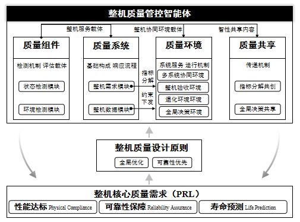

底层 **PRL 核心需求**（性能达标、可靠性保障、寿命预测）→ 设计原则（全局优化、可靠性优先）→ 智能体四层：**质量组件**（状态/环境检测模块）、**质量系统**（整机需求/数据模块，指标分解与约束下发）、**质量环境**（多系统协同、验收、退化、全局决策环境）、**质量共享**（指标分解共创、全局决策共享）。

#### 图16 · 软件质量管控智能体（§2.3.3）

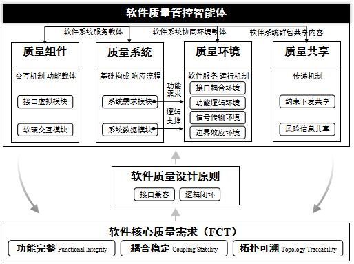

底层 **FCT 核心需求**（功能完整、耦合稳定、拓扑可溯）→ 设计原则（接口兼容、逻辑闭环）→ 智能体含接口虚拟/软硬交互模块、系统需求/数据模块，以及接口耦合、功能逻辑、信号传输、边界效应四类环境；共享约束下发与风险信息。

#### 图17 · 元器件质量管控智能体（§2.3.4）

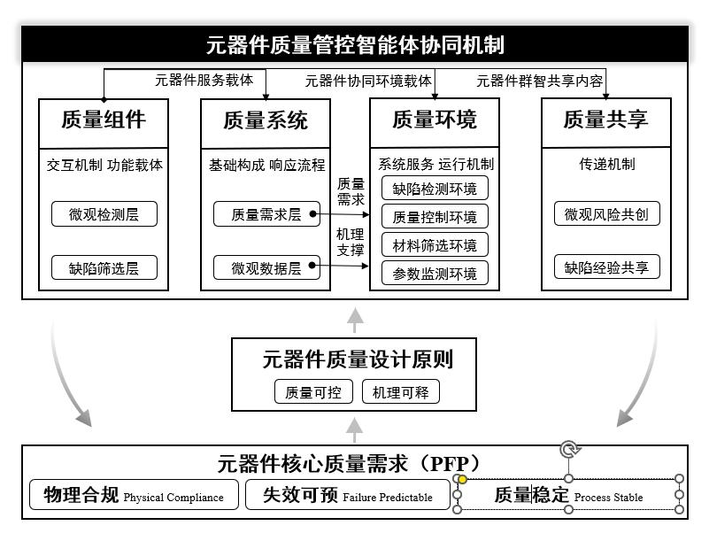

底层 **PFP 核心需求**（物理合规、失效可预、质量稳定）→ 设计原则（质量可控、机理可释）→ 智能体含微观检测/缺陷筛选层、质量需求/微观数据层，以及缺陷检测、质量控制、材料筛选、参数监测四类环境；共享微观风险共创与缺陷经验。

#### 图18 · 质量管控智能决策管理平台（§2.5）

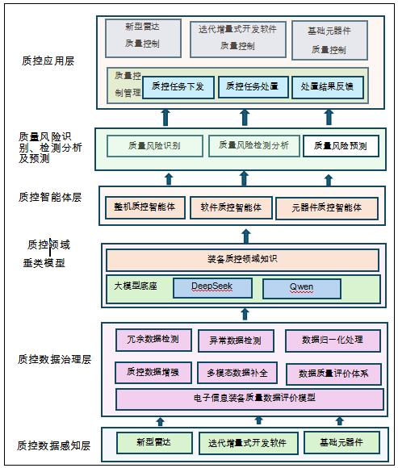

六层平台：**感知层**（雷达/软件/元器件）→ **治理层**（冗余/异常检测、归一化、增强、多模态补全、评价模型）→ **垂类模型层**（领域知识 + DeepSeek/Qwen 底座）→ **智能体层**（三类质控智能体）→ **风险层**（识别/检测分析/预测）→ **应用层**（三类对象质控应用 + 任务下发—处置—反馈闭环）。

---

## 附录：常见划分误区（合并自技术板块方案）

### 问题1：六域A-F是过度抽象

| 申报书原文 | 现有六域 | 问题 |
|-----------|---------|------|
| 1.1 质量数据标准体系 | A 数据标准 | 正确对应 |
| 1.2 数据综合治理 | B 数据治理 | 正确对应 |
| 1.3 质量数据评价 | C 质量评价 | 正确对应 |
| 2.1 知识图谱构建 | D 知识图谱 | **遗漏**：2.1包含"知识图谱构建"和"差异化质量管控"两部分 |
| 2.2 风险预测 | E 预测分析 | **错位**：2.2包含"风险识别"+"检测分析"+"预测"，不只是预测 |
| 2.3-2.5 智能体+平台 | F 平台智能体 | **混淆**：把2.3/2.4/2.5混为一谈，且与关键技术1不完全对应 |

### 问题2：关键对应关系缺失

申报书明确的技术方案与关键技术/创新点的对应关系，在现有文档中未清晰体现：

```
关键技术2（数据综合治理）= 覆盖研究内容1的全部（1.1+1.2+1.3）
创新点1（差异化管控）= 研究内容2.1的后半部分（差异化质量管控技术）
创新点2（风险预测）= 研究内容2.2.3（基于大模型及RAG的潜在风险预测）
关键技术1（三类智能体）= 研究内容2.3+2.4+部分2.5
```

### 问题3：术语混用

- 将2.3的"质量管控智能体"与2.5的"智能决策管理平台"混为一谈
- 将"系统质量管控智能体"（软件侧）误称为其他名称
- 将"风险识别"与"风险预测"技术内容混淆

> 完整四层架构方案已并入本章 §1–§6；勿再以「数据类/检测类/平台」三分法组织任务。


## 7. 相关文档

- [任务与进度规划](./02-任务与进度规划.md)
- [数据与数据集](./03-数据与数据集.md)
- [学习目录总览](./学习目录/00-总览.md)
- [论文核心工作规划](./05-论文核心工作规划.md)
