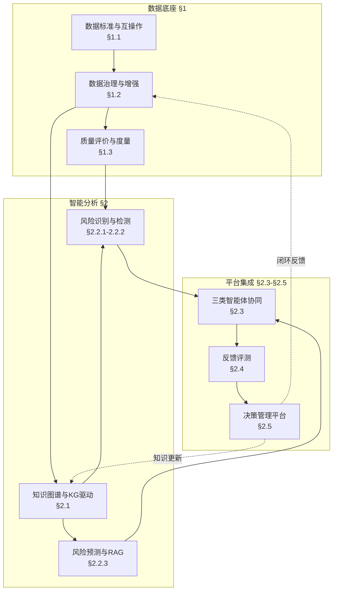

# 领域关键词索引

> 综合来源：申报书第四章技术方案 + 六域A-F知识框架 + 34篇参考文献  
> 用途：文献检索、技术调研、论文写作关键词参考  
> 生成日期：2026-06-12

---

## 一、核心领域全景图



---

## 二、七大核心领域详解

### 领域1：数据标准与语义互操作（§1.1 / 域A）

**核心内涵**：制定装备质量数据的统一描述规范、管理标准，实现跨系统数据交换

**涉及子领域**：
| 子领域 | 说明 | 申报书章节 |
|--------|------|-----------|
| 数据质量管理体系 | ISO 8000框架下的质量三维（句法/语义/语用） | 1.1 |
| 工业互联网标准 | OPC UA、IEC 62424过程数据标准 | 1.1 |
| 全生命周期数据管理 | 设计→研制→生产→试验→运维→退役 | 1.1.1 |
| 术语与编码标准化 | 统一装备质量领域术语定义、分类编码 | 1.1.2 |

**推荐查询关键词**：
```
中文：
- 数据质量标准、数据治理规范、GB/T 34960.5
- 工业互联网数据标准、OPC UA信息模型
- 装备质量数据管理、全生命周期数据标准
- 术语标准化、数据编码规范、元数据管理

英文：
- ISO 8000 data quality, IEC 62424 process data
- OPC UA information model, industrial data standards
- Equipment quality data management, PLM data standards
- Metadata management, data interoperability
- Semantic web for manufacturing, data contract
```

---

### 领域2：多模态质量数据治理（§1.2 / 域B）

**核心内涵**：对高维、异构、多模态质量数据进行清洗、异常检测、缺失补全、智能标注

**涉及子领域**：
| 子领域 | 关键技术 | 申报书章节 |
|--------|----------|-----------|
| 特征筛选与降维 | 统计分布约束、稀疏表示、Lasso | 1.2.1 |
| 异常检测 | 软阈值滑动窗口、RANSAC、半监督异常检测 | 1.2.1 |
| 缺失数据补全 | GAN、扩散模型、时空扩散、共形预测 | 1.2.2-1.2.3 |
| 智能标注 | 多模态绑定规则、LLM辅助标注 | 1.2.1 |
| 时序数据处理 | CWT小波变换、Z-score归一化 | 1.2 |

**推荐查询关键词**：
```
中文：
- 多模态数据治理、质量数据清洗、异常值检测
- 软阈值异常检测、滑动窗口算法
- 缺失数据补全、生成对抗网络GAN、扩散模型
- 时空数据补全、神经随机微分方程、LoRA微调
- 高维特征筛选、稀疏表示学习、特征选择
- 智能数据标注、主动学习、人机协同标注
- 共形预测、不确定性量化、置信区间

英文：
- Multimodal data governance, data curation, data cleaning
- Anomaly detection, outlier detection, soft threshold
- Missing data imputation, GAN for data generation
- Diffusion model, Denoising Diffusion Probabilistic Model (DDPM)
- Spatio-temporal data completion, Neural SDE
- Sparse representation, feature selection, Lasso regression
- Conformal prediction, uncertainty quantification
- Active learning, intelligent data labeling
- Time series anomaly detection, RANSAC regression
```

---

### 领域3：质量评价与多准则决策（§1.3 / 域C）

**核心内涵**：构建装备质量数据的多维度评价指标体系，融合主客观权重进行综合评价

**涉及子领域**：
| 子领域 | 方法 | 申报书章节 |
|--------|------|-----------|
| 评价指标体系 | 灰色关联分析、D-S证据理论 | 1.3.1 |
| 组合赋权 | 熵权法、CRITIC、博弈论组合权重 | 1.3.1 |
| 模糊综合评价 | AHP、FCE、隶属度函数 | 1.3.2 |
| 特征提取 | Lasso回归筛选关键因子 | 1.3.2 |
| 质量评估框架 | QUADAS-3、QUAIDE、AI模型五项准则 | 方法论借鉴 |

**推荐查询关键词**：
```
中文：
- 综合评价指标体系、数据质量评价五维
- 灰色关联分析GRA、D-S证据理论、Dempster-Shafer
- 多准则决策MCDM、层次分析法AHP、熵权法
- TOPSIS评价、CRITIC赋权、博弈论权重组合
- 模糊综合评价FCE、直觉模糊集、q阶正交模糊集q-ROF
- Lasso特征提取、稀疏正则化
- 诊断准确性评估QUADAS、AI模型质量评估

英文：
- Multi-criteria decision making MCDM, comprehensive evaluation
- Grey relational analysis GRA, Dempster-Shafer evidence theory
- Analytic Hierarchy Process AHP, entropy weight method
- TOPSIS, CRITIC method, game theory weighting
- Fuzzy comprehensive evaluation FCE, intuitionistic fuzzy
- Lasso regression, L1 regularization, feature selection
- QUADAS-3 quality assessment, AI model evaluation
- Composite indicator construction, weight determination
```

---

### 领域4：知识图谱与知识工程（§2.1 / 域D）

**核心内涵**：构建装备质量领域的知识图谱，实现质量知识的结构化存储、推理与应用

**涉及子领域**：
| 子领域 | 技术 | 申报书章节 |
|--------|------|-----------|
| 知识抽取 | NER命名实体识别、关系抽取 | 2.1.1 |
| 知识表示 | 本体建模、OWL、RDF、Neo4j图数据库 | 2.1.1 |
| 知识推理 | 路径推理、根因追溯、GNN策略推荐 | 2.1.2 |
| 知识更新 | 增量图谱更新、版本管理 | 2.1.2 |
| 混合存储 | Neo4j+MySQL+FastDFS架构 | 2.1.1 |

**推荐查询关键词**：
```
中文：
- 知识图谱构建、领域本体、装备质量本体
- 命名实体识别NER、BERT-BiLSTM-CRF、提示学习Prompt
- 关系抽取、三元组抽取、开放信息抽取
- 图数据库Neo4j、图神经网络GNN、GraphRAG
- 根因分析、故障追溯、影响传播分析
- 增量知识图谱、动态图谱更新
- 知识融合、实体对齐、本体对齐

英文：
- Knowledge graph construction, domain ontology
- Named entity recognition NER, BERT-BiLSTM-CRF
- Relation extraction, prompt learning for RE
- Graph database Neo4j, graph neural network GNN
- GraphRAG, knowledge graph reasoning
- Root cause analysis, fault traceability
- Incremental knowledge graph, dynamic graph update
- Knowledge fusion, entity alignment
- Industrial knowledge graph, manufacturing ontology
```

---

### 领域5：质量风险识别与预测（§2.2 / 域E）

**核心内涵**：基于机器学习和大模型技术，实现装备质量风险的检测、预测与预警

**涉及子领域**：
| 子领域 | 技术 | 申报书章节 |
|--------|------|-----------|
| 风险识别 | 质量问题分析树、FMEA、图谱路径匹配 | 2.2.1 |
| 故障检测 | Seq2Seq自编码器、CNN-LSTM、对比学习 | 2.2.2 |
| 寿命预测 | Wiener退化过程、RUL预测 | 2.2.2 |
| 大模型预测 | DeepSeek/Qwen、RAG、补丁重编程 | 2.2.3 |
| 时序分析 | DTW、STL分解、GAF/MTF时序转图 | 2.2 |

**推荐查询关键词**：
```
中文：
- 质量风险识别、故障模式与影响分析FMEA
- 异常检测、故障诊断、少样本故障检测
- 剩余使用寿命RUL、退化过程建模
- 维纳过程Wiener process、加速退化试验
- 自编码器AE、变分自编码器VAE、Seq2Seq
- CNN-LSTM、时序卷积网络、Transformer时序
- 对比学习、自监督学习、时序反转预测
- 大模型风险预测、检索增强生成RAG
- 提示学习Prompt、指令微调、LoRA
- 时序对齐DTW、STL时序分解
- 格拉姆角场GAF、马尔可夫转移场MTF

英文：
- Quality risk identification, FMEA, fault diagnosis
- Anomaly detection, fault detection, few-shot fault detection
- Remaining useful life RUL prediction, prognostics
- Wiener process degradation, accelerated degradation testing
- Autoencoder AE, VAE, Seq2Seq anomaly detection
- CNN-LSTM, TCN, Transformer for time series
- Contrastive learning, self-supervised learning
- Large language model for risk prediction, RAG
- Prompt engineering, instruction tuning, LoRA
- Dynamic time warping DTW, STL decomposition
- Gramian Angular Field GAF, Markov Transition Field MTF
- Patch reprogramming, multimodal alignment
```

---

### 领域6：多智能体协同与决策（§2.3 / 域F）

**核心内涵**：构建整机/软件/元器件三类质量管控智能体，实现群智协同决策

**涉及子领域**：
| 子领域 | 核心内容 | 申报书章节 |
|--------|----------|-----------|
| 整机智能体 | 质量指标分解、全局决策共享 | 2.3.2 |
| 软件智能体 | 耦合稳定性、风险可追溯 | 2.3.3 |
| 元器件智能体 | 质量可控、机理可解释 | 2.3.4 |
| 群智决策 | 博弈论、共识算法、冲突消解 | 2.3.1 |
| 评价反馈 | 证据融合、集对分析 | 2.4 |

**推荐查询关键词**：
```
中文：
- 多智能体系统MAS、智能体协同、群智决策
- 博弈论、纳什均衡、共识算法、一致性协议
- 多层级决策、分布式决策、冲突消解
- 整机质量管控、软件质量管控、元器件质量管控
- 机理可解释性、物理信息神经网络PINN
- 证据融合、集对分析、联系数
- 二元语义、语言评价、模糊偏好关系

英文：
- Multi-agent system MAS, agent coordination
- Game theory, Nash equilibrium, consensus algorithm
- Distributed decision making, conflict resolution
- Equipment quality control, software quality control
- Component quality management, mechanism interpretability
- Physics-informed neural network PINN
- Evidence fusion, set pair analysis
- Multi-level quality management, hierarchical control
```

---

### 领域7：平台工程与系统集成（§2.5 / 域F）

**核心内涵**：构建分层解耦的质量管控智能决策管理平台，实现全流程闭环

**涉及子领域**：
| 子领域 | 架构/技术 | 申报书章节 |
|--------|-----------|-----------|
| 分层架构 | 感知层-治理层-知识层-应用层 | 2.5 |
| 数据闭环 | 汇聚→治理→检测→分析→处置→优化 | 2.5 |
| 混合存储 | Neo4j+MySQL+FastDFS | 2.1.1 |
| 服务化 | REST API、模型服务、微服务 | 平台实现 |
| 安全审计 | 权限管理、数据血缘、审计追踪 | 平台实现 |

**推荐查询关键词**：
```
中文：
- 质量管控平台、智能决策平台、QMS质量管理系统
- 分层架构、微服务架构、中台架构
- 数据闭环、反馈控制、持续优化
- 混合存储、图数据库、分布式文件系统
- 数据血缘、数据溯源、审计追踪
- FastAPI、模型即服务MaaS
- 数字孪生、工业物联网IIoT

英文：
- Quality management system QMS, intelligent decision platform
- Layered architecture, microservices, data mesh
- Data闭环 loop, feedback control, continuous improvement
- Hybrid storage, graph database, distributed file system
- Data lineage, data provenance, audit trail
- Model as a service MaaS, API gateway
- Digital twin, Industrial IoT IIoT
- Smart manufacturing platform, Quality 4.0
```

---

## 三、跨领域交叉主题

### 交叉1：数据治理 × 知识图谱
- **关键词**：知识图谱驱动的数据治理、语义数据质量、本体约束的数据清洗
- **查询**：semantic data quality, ontology-based data cleaning

### 交叉2：时序分析 × 大模型
- **关键词**：时序大模型、Time-LLM、时序补丁重编程、多模态对齐
- **查询**：Time-LLM, time series foundation model, patch reprogramming

### 交叉3：不确定性 × 决策
- **关键词**：不确定性感知决策、置信度校准、风险评估
- **查询**：uncertainty-aware decision making, calibrated confidence

### 交叉4：少样本 × 装备质量
- **关键词**：少样本故障诊断、零样本异常检测、长尾分布
- **查询**：few-shot fault diagnosis, zero-shot anomaly detection

---

## 四、按申报书章节快速检索表

| 申报书章节 | 主要领域 | 核心关键词（中文+英文） |
|-----------|---------|----------------------|
| **§1.1** 数据标准 | 领域1 | ISO 8000、数据互操作、元数据管理、data interoperability |
| **§1.2** 数据治理 | 领域2 | 异常检测、缺失补全、GAN/扩散、anomaly detection, data imputation |
| **§1.3** 质量评价 | 领域3 | MCDM、灰色关联、D-S证据、AHP、TOPSIS、multi-criteria decision |
| **§2.1** 知识图谱 | 领域4 | 知识图谱、NER、关系抽取、Neo4j、knowledge graph, NER |
| **§2.2** 风险预测 | 领域5 | RUL预测、Wiener过程、RAG、大模型、prognostics, LLM+RAG |
| **§2.3** 智能体 | 领域6 | 多智能体、博弈论、共识算法、multi-agent, game theory |
| **§2.5** 平台 | 领域7 | QMS平台、数据闭环、分层架构、quality management platform |

---

## 五、顶级会议与期刊推荐

### 数据治理与标准
- **期刊**：Data & Knowledge Engineering, Journal of Data and Information Quality
- **会议**：EDBT, ICDE, CIKM

### 知识图谱与NLP
- **会议**：ACL, EMNLP, NAACL, WWW, ISWC
- **期刊**：Journal of Web Semantics, Knowledge-Based Systems

### 机器学习与PHM
- **会议**：ICML, NeurIPS, KDD, ICLR, PHM Society Conference
- **期刊**：IEEE Transactions on Reliability, Mechanical Systems and Signal Processing

### 多准则决策
- **期刊**：European Journal of Operational Research, Fuzzy Sets and Systems
- **会议**：MCDM, IEEE SMC

### 工业物联网与平台
- **会议**：IEEE CASE, INDIN, ETFA
- **期刊**：IEEE Transactions on Industrial Informatics, Computers in Industry

---

## 六、相关文档

- [申报书技术方案](./01-申报书技术方案.md)
- [数据与数据集](./03-数据与数据集.md)
- [论文核心工作规划](./05-论文核心工作规划.md)
- [学习路线](./学习目录/01-学习路线.md)
