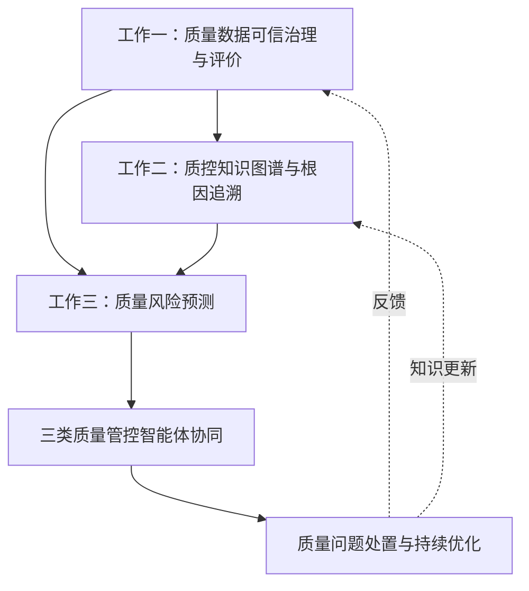

# 论文核心工作规划

> 面向方向：新一代电子信息装备（雷达整机 / 雷达软件 / 元器件）差异化质量管控  
> 目标：把申报书技术方案收敛为未来论文可写、可实验、可逐步实现的三项核心工作  
> 关联文档：[申报书技术方案](./01-申报书技术方案.md)、[数据与数据集](./03-数据与数据集.md)  
> 更新日期：2026-06-14

---

## 一、总论文主线

### 1.1 建议总题目方向

**面向电子信息装备的质量数据治理、知识驱动风险分析与差异化智能管控方法研究**

如果进一步贴合当前任务对象，可改成：

**面向雷达装备及其软件、元器件的差异化质量风险识别与智能管控方法研究**

### 1.2 总体问题

雷达类电子信息装备的质量问题不是单一检测问题，而是贯穿设计、研制、生产、测试、交付、运维全过程的复杂质量管控问题。其难点主要包括：

- 数据层：雷达整机、软件、元器件质量数据来源分散，存在缺失、异常、冗余、标准不统一问题。
- 知识层：质量问题、故障现象、元器件、软件版本、测试环境、处置措施之间缺乏结构化关联。
- 决策层：整机、软件、元器件三类对象的风险机理不同，传统统一管控方式难以实现差异化预警、根因追溯与协同处置。

### 1.3 三项核心工作总览


| 核心工作                 | 对应申报书                   | 论文角色 | 解决的问题                      |
| -------------------- | ----------------------- | ---- | -------------------------- |
| 工作一：质量数据可信治理与评价      | §1.1、§1.2、§1.3          | 数据底座 | 原始质量数据不完整、不一致、异常多、难以支撑后续建模 |
| 工作二：质控知识图谱与差异化根因追溯   | §2.1、§2.2.1             | 知识底座 | 质量问题与原因、对象、环境、处置之间缺乏可推理关联  |
| 工作三：质量风险预测与三类智能体协同管控 | §2.2.2、§2.2.3、§2.3、§2.4 | 智能决策 | 风险发现滞后，整机/软件/元器件之间缺少协同处置机制 |


---

## 二、核心工作一：质量数据可信治理与评价

> 对应插图：图1（§1 总路线）、图2（缺失补全）、图3（时空扩散）、图4（Lasso-FCE 评价）→ [01-申报书技术方案 §8](./01-申报书技术方案.md#8-技术方案插图图1图18)

### 2.1 研究目标

面向新型雷达整机、迭代增量式软件与基础元器件三类质控对象，构建覆盖论证、设计、研制、生产、试验、使用与维护全阶段的多源异构质量数据治理体系。研究以质控数据规范为前提，经多模态数据清洗、缺失补全与异常识别完成数据增强，再建立多维度质量评价模型对治理结果进行量化评估，并将评价结论反馈至数据增强环节，形成「规范—治理—增强—评价」闭环。最终输出结构统一、质量可信、可用于建模与知识抽取的数据底座，为质控知识图谱构建与质量风险识别提供输入保障。

### 2.2 可聚焦的问题

- 质量数据来自不同阶段：设计、生产、测试、运维、维修。
- 数据模态不同：表格、时序、日志文本、检测图像、雷达信号图。
- 数据质量问题突出：缺失值、异常值、冗余特征、量纲不一致、标签不足。
- 缺少一个能说明“这批数据是否可信、是否适合用于质量风险分析”的评价方法。

### 2.3 可采用的实现方法

本板块技术路线按申报书 §1 四段式主线展开：在明确质控数据源与对象边界的基础上，首先完成字段、单位与时间基准的统一；继而开展统计与智能相结合的清洗、补全与异常处置；对雷达运行、元器件退化等时序数据辅以滑动窗口动态监测；最后以多准则评价模型输出数据质量等级，并支撑多模态数据的关联绑定与标注。四类方法前后衔接、逐层递进，共同构成可信治理流水线。

#### 方法1：基于规则与统计的数据预处理

针对多系统接入初期数据格式杂乱、量纲不一的问题，以规则与统计方法建立治理基线。在统一字段命名、物理单位与时间戳对齐的基础上，完成缺失值填补、野值识别与特征归一化，为后续智能补全与模型训练提供口径一致的基础数据集。

- 数据格式统一：字段命名、单位统一、时间戳对齐。
- 缺失值处理：均值/中位数填充、KNN补全、插值补全。
- 异常值识别：3σ、IQR、Isolation Forest、One-Class SVM。
- 归一化：Z-score、Min-Max。
- 特征筛选：方差筛选、相关性筛选、Lasso。

#### 方法2：面向时序质量数据的滑动窗口异常检测

针对雷达整机运行监测、元器件性能退化与软件运行指标等连续时序数据波动大、固定阈值易误判的特点，采用局部滑动窗口刻画正常波动范围。在窗口内提取统计与频域特征，结合软阈值机制识别局部异常片段，为制造过程波动与在轨状态偏离提供时序侧异常线索。

- 将长时间序列切分为滑动窗口。
- 对每个窗口计算均值、方差、趋势、峰度、偏度、频域能量等特征。
- 基于局部窗口构造动态阈值，识别局部异常。
- 可进一步加入软阈值机制，降低噪声对异常判断的影响。

#### 方法3：质量数据综合评价模型

在清洗与增强完成后，需要回答治理结果是否达到可用于风险分析的质量门槛。本环节构建覆盖正确性、完整性、一致性、时效性与可解释性等维度的指标体系，综合确定权重并度量指标关联，最终输出优、良、中、差等等级及可解释的缺陷诊断结论，评价结果可反向指导数据增强策略调整。

- 建立指标体系：正确性、完整性、一致性、时效性、可解释性。
- 使用 AHP 或 CRITIC 确定指标权重。
- 使用灰色关联分析度量指标之间的关联。
- 使用模糊综合评价输出数据质量等级：优、良、中、差。

#### 方法4：多模态质量数据绑定与标注

面向同一装备、同一批次或同一试验任务下并存的表格记录、运行日志、检测图像与时序信号，建立跨模态关联与语义标注机制。通过装备编号、批次号与时间戳等规则完成数据绑定，并引入人机协同标注方式，使多模态质控数据在统一语义框架下可被检索、比对与联合分析。

- 将同一装备、同一批次、同一测试任务下的表格、日志、图像、时序信号建立关联。
- 基于命名规则、时间戳、装备编号、批次号建立数据绑定规则。
- 使用大模型辅助生成初始标签，再由人工确认。

### 2.4 可用数据集


| 数据                             | 用途              | 说明                         |
| ------------------------------ | --------------- | -------------------------- |
| `datasets/01_tabular_secom`    | 元器件/半导体制造质量数据治理 | 最建议作为工作一起点                 |
| `datasets/03_phm_nasa_cmapss`  | 时序缺失补全、退化数据治理   | 可验证滑动窗口和RUL特征              |
| NASA Capacitor / MOSFET / IGBT | 元器件老化与健康数据      | 更贴近元器件质量                   |
| Rad-R / RADIal / RaDICaL       | 雷达信号质量指标构造      | 注意目标检测任务本身不是质量管控，应转为信号质量分析 |
| PROMISE / CodeXGLUE            | 软件质量数据治理        | 可作为软件质量数据分支                |


### 2.5 可形成的论文小标题

**面向电子信息装备质量风险分析的多源质量数据可信治理与评价方法**

---

## 三、核心工作二：质控知识图谱与差异化根因追溯

> 对应插图：图5（§2 总路线）、图6–7（NER/RE）、图8（质量问题分析树）、图14（协同机制）→ [§2.1 学习域](./学习目录/02-知识域/§2.1-知识图谱与NLP大模型.md)

### 3.1 研究目标

面向雷达整机、软件与元器件三类质控对象，构建覆盖质量问题、故障现象、检测指标、对象层级、环境工况与处置措施的质量管控知识图谱。研究首先建立质控领域本体，明确实体与关系类型；继而自测试报告、维修记录与标准规范等非结构化文本中抽取三元组，写入图数据库形成可查询、可推理的知识资产；在此基础上开展质量状态关联分析、沿因果链的根因追溯，并按对象类型推荐差异化管控策略，为风险识别与智能体协同提供知识支撑。

### 3.2 可聚焦的问题

- 质量问题描述多为文本，分散在测试报告、维修记录、专家意见、标准规范中。
- 雷达整机故障可能由软件缺陷、元器件失效、环境工况共同引发。
- 传统表格记录难以表达“现象-原因-对象-处置”的多跳关系。
- 缺少将质量问题转化为可推理知识的机制。

### 3.3 可采用的实现方法

本板块按「本体定义—知识抽取—图谱构建—关联推理—策略输出」链条组织。先以领域本体约束图谱模式，再从文本中抽取实体与关系写入图数据库；当监测或检测环节出现异常现象时，沿图谱反向遍历定位可能根因，并依据整机、软件、元器件不同机理推荐差异化处置措施。四类方法相互衔接，体现申报书 §2.1 知识驱动差异化管控的技术逻辑。

#### 方法1：构建质量管控本体

质控知识图谱构建的首要任务是明确领域概念体系与关系模式。本体需覆盖装备对象层级、软件版本与接口、质量现象与指标、环境工况及处置措施等核心实体，并定义属于、导致、关联、发生于、处置为、影响等关系类型，为后续抽取、融合与推理提供统一语义约束。

实体类型可包括：

- 装备对象：雷达整机、分系统、模块、元器件。
- 软件对象：软件版本、模块、接口、变更记录、缺陷单。
- 质量现象：告警、指标异常、测试失败、性能退化。
- 质量指标：SNR、误码率、温度、电压、电流、缺陷密度、测试覆盖率。
- 环境工况：温度、湿度、振动、电磁干扰、任务剖面。
- 处置措施：更换、返修、复测、降额、版本回退、参数校准。

关系类型可包括：

- `属于`：元器件属于模块，模块属于整机。
- `导致`：元器件漂移导致指标异常。
- `关联`：软件版本与故障现象关联。
- `发生于`：质量问题发生于某阶段、某批次、某工况。
- `处置为`：故障对应处置措施。
- `影响`：底层故障影响系统性能。

#### 方法2：从文本中抽取实体与关系

在本体约束下，将分散于质控文档中的知识转化为结构化三元组。基础阶段可采用规则词典与模板匹配快速积累种子知识；进阶阶段引入命名实体识别与关系抽取模型，对专业术语、故障描述与处置记录进行自动标注，经人工校验后增量写入图数据库，支撑图谱持续更新。

基础版本：

- 用规则词典抽取装备名、故障名、指标名、处置词。
- 使用正则和关键词模板抽取“现象-原因-措施”。

进阶版本：

- 使用 BERT-BiLSTM-CRF 做命名实体识别。
- 使用提示学习或大模型抽取三元组。
- 人工校验后写入 Neo4j。

#### 方法3：基于图谱的根因追溯

当风险识别或监测环节给出异常现象后，在已构建的质控知识图谱中检索与之相连的指标、部件、环境与历史案例，沿导致、影响、发生于等关系反向遍历，对候选根因进行排序与解释。该过程将申报书所强调的反向图遍历根因追溯落到可执行的图查询与路径推理流程上。

实现思路：

- 输入一个异常现象，如“接收通道噪声升高”。
- 在图谱中查找与该现象相连的指标、部件、环境、历史案例。
- 沿 `导致`、`影响`、`发生于` 等关系反向遍历。
- 输出可能根因排序：元器件老化、温度异常、软件版本变更、校准失效等。

#### 方法4：差异化管控策略推荐

根因定位完成后，需结合对象类型与风险等级生成可执行的管控建议。整机侧重复测校准与任务剖面限制，软件侧重版本回退与回归验证，元器件侧重批次筛查与降额使用，策略推荐结果与图谱中的处置实体及历史案例保持一致，体现差异化质量管控要求。

根据对象类型和风险等级输出不同策略：

- 雷达整机：复测、校准、整机环境试验、任务限制。
- 软件：版本回退、补丁测试、接口联调、回归测试。
- 元器件：批次筛查、老化试验、更换、降额使用。

### 3.4 可用数据与知识来源


| 数据/知识                                                    | 用途                   |
| -------------------------------------------------------- | -------------------- |
| 申报书技术方案文本                                                | 构建初始本体和术语表           |
| `datasets/07_semantic_iof`、`datasets/10_text_rag_sample` | 学习 RDF/OWL、本体、RAG 结构 |
| 自建小型质控案例                                                 | 构造“现象-原因-处置”样例       |
| 公开软件缺陷数据                                                 | 构建软件质量问题子图           |
| 元器件退化/PCB缺陷数据                                            | 构建元器件质量问题子图          |
| 后续真实维修记录/测试报告                                            | 替换公开样例，形成真实质控图谱      |


### 3.5 可形成的论文小标题

**基于质量知识图谱的电子信息装备差异化质量根因追溯与策略推荐方法**

---

## 四、核心工作三：质量风险预测与三类智能体协同管控

> 对应插图：图9–13（检测/预测）、图12（垂类模型）、图14–18（智能体与平台）→ [§2.2](./学习目录/02-知识域/§2.2-机器学习与可靠性预测.md)、[§2.3-2.5](./学习目录/02-知识域/§2.3-2.5-平台工程与智能体系统.md)

### 4.1 研究目标

在质量数据可信治理与质控知识图谱基础上，构建面向雷达整机、软件与元器件的质量风险识别、检测分析与潜在风险预测方法，并建立整机、软件、元器件三类质量管控智能体协同机制。研究形成从异常发现、风险研判、知识增强解释到协同处置建议生成的完整链路，结合反馈响应效果评测，支撑装备质量持续优化，落实申报书 §2.2–§2.4 智能化质量风险识别、反馈与响应技术路线。

### 4.2 可聚焦的问题

- 质量风险具有隐蔽性，故障发生前往往只有弱异常或趋势变化。
- 故障样本少，监督学习模型容易过拟合。
- 单一模型只能判断异常，难以解释异常原因。
- 整机、软件、元器件之间存在影响传播，单点处置不一定解决全局问题。

### 4.3 可采用的实现方法

本板块按申报书 §2 风险识别与响应主线串联四项能力：先以机器学习与深度学习模型完成质量风险检测与异常识别；对少样本场景辅以自编码器重构误差判异；再将检测结果与质控知识图谱、案例库结合，经检索增强生成完成风险解释与潜在风险预测；最后由整机、软件、元器件三类智能体在指标分解与风险汇总机制下输出协同处置建议，并经反馈评测闭环迭代。

#### 方法1：基于机器学习的风险检测

面向表格型制造质量数据与运行监测时序数据，采用监督与无监督相结合的检测分析手段，输出异常概率、风险等级与关键特征，为后续图谱追溯与智能体决策提供量化输入。该环节对应申报书质量风险检测分析要求，是风险识别链路的入口。

- 表格质量数据：随机森林、XGBoost、逻辑回归、SVM。
- 时序质量数据：滑动窗口特征 + 分类器。
- 少样本异常：Isolation Forest、One-Class SVM、自编码器。
- 输出结果：异常概率、风险等级、重要特征。

#### 方法2：基于自编码器的少样本故障检测

针对装备现场故障样本稀缺、正常工况数据相对充足的特点，以正常样本训练自编码器学习重构模式，将重构误差作为异常度量，并可扩展为序列到序列结构以适配多元时序。检测出的异常片段进一步映射至知识图谱中的质量现象节点，衔接根因追溯与解释环节。

实现路线：

1. 只使用正常样本训练自编码器。
2. 模型学习正常数据的重构模式。
3. 输入新样本，计算重构误差。
4. 重构误差超过阈值则判定为异常。
5. 将异常片段映射到知识图谱，辅助解释原因。

可选模型：

- 普通 AutoEncoder。
- LSTM AutoEncoder。
- GRU Seq2Seq AutoEncoder。
- Transformer AutoEncoder。

#### 方法3：基于知识增强 RAG 的风险解释

在模型给出风险判定后，提取异常指标、对象、时间与工况等上下文，检索质控知识图谱与历史案例，将结构化证据组织为提示上下文，由垂类大模型生成风险解释与处置建议。判断依据主要来自检测模型与图谱推理，生成层侧重证据整合与表述，以降低幻觉并支撑可溯源决策。

流程：

```text
异常检测结果
  -> 提取异常指标、对象、时间、工况
  -> 检索质控知识图谱和案例库
  -> 拼接上下文
  -> 大模型生成风险解释和处置建议
```

#### 方法4：三类智能体协同机制

在风险分析结果基础上，按申报书 §2.3 构建整机、软件、元器件三类质量管控智能体。整机智能体负责质量指标分解与全局决策共享，软件智能体关注耦合稳定与风险可溯，元器件智能体关注参数可控与失效机理可释；通过自上而下分解、自下而上汇总与冲突协调机制，形成群智协同的质量处置方案，并由 §2.4 反馈评测检验及时性、有效性与完备性。

| 智能体        | 输入                  | 输出                | 关键职责          |
| ---------- | ------------------- | ----------------- | ------------- |
| 整机质量管控智能体  | 整机指标、任务环境、下级风险      | 全局风险等级、任务影响、处置优先级 | 质量指标分解、全局决策共享 |
| 软件质量管控智能体  | 软件缺陷、版本变更、接口日志、测试结果 | 软件风险、可疑模块、回归测试建议  | 耦合稳定、风险可溯     |
| 元器件质量管控智能体 | 参数漂移、批次数据、老化试验、视觉缺陷 | 元器件风险、失效机理、筛选建议   | 质量可控、机理可释     |

协同机制：

- Top-Down：整机质量目标分解到软件和元器件。
- Bottom-Up：软件/元器件异常向整机反馈风险。
- 横向共享：同批次元器件、相似软件模块、相似故障案例共享。
- 冲突处理：当“继续任务”和“停机维修”冲突时，根据风险等级和任务约束做优先级决策。

### 4.4 可用数据集


| 数据                              | 用途                    |
| ------------------------------- | --------------------- |
| SECOM                           | 元器件制造质量风险分类           |
| NASA Capacitor / MOSFET / IGBT  | 元器件退化预测、RUL           |
| PROMISE / CodeXGLUE / Defects4J | 软件缺陷预测、软件质量风险         |
| Rad-R                           | 雷达硬件异常与严重度识别          |
| RADIal / K-Radar / RaDICaL      | 雷达信号质量、场景鲁棒性、数据治理方法验证 |
| 自建案例库                           | RAG解释、智能体处置建议         |


### 4.5 可形成的论文小标题

**知识增强的电子信息装备质量风险预测与三类智能体协同管控方法**

---

## 五、三项核心工作的关系




三项工作按「数据底座—知识底座—智能决策」逐层递进，与申报书总体闭环相呼应：工作一完成质量数据汇聚与可信治理，工作二将治理结果与领域知识融合为质控知识图谱并支撑根因追溯，工作三在图谱与数据之上开展风险检测、预测与智能体协同处置，处置与评测结果再反馈至数据治理与知识更新环节。

1. 工作一解决“数据能不能用”。
2. 工作二解决“问题和原因如何关联”。
3. 工作三解决“如何预测风险并协同处置”。

---

## 六、申报书创新点

> 来源：申报书第四章技术方案。完整章节索引见 [01-申报书技术方案](./01-申报书技术方案.md)。

### 创新点 1：基于质控知识图谱的电子信息装备差异化质量管控技术

**对应章节**：§2.1.2  
**对应核心工作**：工作二（质控知识图谱与差异化根因追溯）

依托质控知识图谱关联推理，解决电子信息装备层级质量管控难题。核心机制包括：


| 机制            | 内容                               |
| ------------- | -------------------------------- |
| **层级影响传播分析**  | 打通从元器件到整机的质量状态关联，量化层级间质量影响       |
| **反向图遍历根因追溯** | 从故障现象沿图谱路径定位根因，替代纯人工经验排查         |
| **动态权重差异化评价** | 引入多维度约束，为每台装备计算差异化质量评分，推荐个性化管控策略 |
| **增量式图谱更新**   | 支持新知识注入与旧知识版本管理，实现知识动态演化         |


### 创新点 2：基于大模型及知识驱动的电子信息装备潜在质量风险预测技术

**对应章节**：§2.2.3  
**对应核心工作**：工作三（质量风险预测与三类智能体协同管控）

面向潜在质量风险隐蔽、难以提前识别的问题，核心机制包括：


| 机制                     | 技术要点                                      |
| ---------------------- | ----------------------------------------- |
| **DTWBA-K-means 时序聚类** | 将动态时间规整与中心化思想融入 K-means，缓解时序偏移与异常对欧式距离的影响 |
| **先验知识注入 Prompt**      | 将质量管理知识库、STL 分解等专业先验注入提示词，增强大模型对质控场景的适配   |
| **补丁重编程多模态对齐**         | 通过多头交叉自注意力实现时序数据与文本知识的模态对齐                |
| **隐式到显式预测流程**          | 经知识库特征提取、先验引导与多模态融合编码，将潜在风险转化为可提前处置的显式输出  |


---

### 可能的创新方向

存在问题：

数据清洗与下游预测割裂：传统工业数据治理多为“一次性清洗”，仅粗粒度地判断数据是否可用，忽略了治理过程中产生的二阶误差（如时序缺失值补全带来的不确定性）对下游风险预测模型的影响。

风险决策过于确定化：现有的质量预测模型往往仅输出一个单一的、绝对的异常评分，未能将原始数据的噪声水平、不完整性与模型自身的泛化波动进行统一表征，容易导致工业现场的误报或漏报。

尝试方法：  
2.1 构建的细粒度可信数据治理流程传统的工业数据预处理通常局限于粗粒度的“剔除”或“填补”，本研究拟尝试将数据质量从单一维度扩展为多维结  
细粒度多维质量诊断：计划不仅考察数据的完整性，还将同时引入一致性、时序性、规范性以及可追溯性等细粒度子指标。针对不同批次、不同工况的数据，尝试输出可解释的结构化诊断报告，明确指出质量缺陷的具体维度。闭环治理与可信度输出：拟将异常检测、时序缺失补全（如滑动窗口插值或深度时序补全）以及一致性修复整合为一个连续的过程。在此基础上，尝试引入数据可信度输出机制，使治理后的每条时序数据不仅包含数值本身，还附带一个量化的置信度指标。  
2.2 探索的数据与模型不确定性统一传播机制在获取前端治理的置信度后，尝试解决“不确定性如何在链路上流动”的问题，将传统的“确定性判断”升级为“风险感知型决策”：