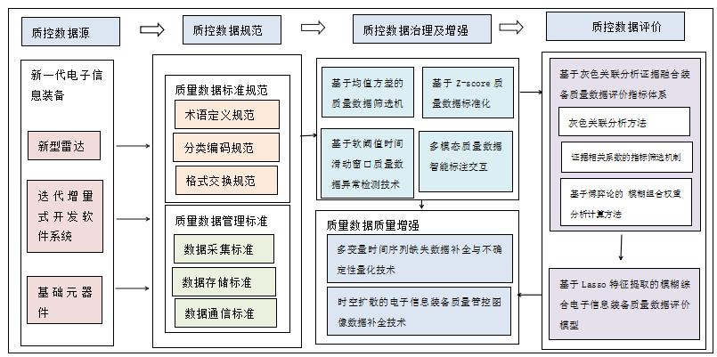

# §1.1 数据标准与工业互联网

> 申报书章节：**§1.1 质量数据标准体系构建方法** | 主要论文：[01]–[07]

---

## 1. 这个领域在学什么

让装备质量数据**有统一说法、统一格式、能跨系统交换**——解决「各说各话、数据孤岛」。

---

## 2. 核心概念（外行版）

### 2.1 数据质量标准（ISO 8000 / IEC 62424 / 国标）

- **ISO 8000**：国际「数据质量」标准系列，强调数据要**语法正确、语义准确、用途匹配**（句法/语义/语用三维）。
- **IEC 62424**：面向过程工业的数据表达规范。
- **GB/T 34960.5-2018**：国内「数据治理规范」，与 ISO 思路兼容。

**在本项目**：研究内容 1.1 要制定装备质量数据描述规范与管理标准，以上标准为底座。

### 2.2 全生命周期数据管理

装备从论证→设计→研制→生产→试验→使用→维护→退役，每个阶段都产生质量数据。需要规定：**采什么、怎么采、存哪、谁能用**。

### 2.3 IoT 与数据质量评估

物联网设备持续上报数据，但要评估：**准不准、全不全、及时不及时**。论文 [02] 用自适应加权融合多源估计。

### 2.4 工业互联网成熟度

企业数字化水平参差不齐。论文 [05] 用**熵权法 + 因子分析**评估建材行业工业互联网成熟度——方法可迁移到装备企业现状调研。

### 2.5 模糊多准则决策（MCDM）

多个指标下做评价排序。论文 [06] 用 **q 阶正交模糊集** 评电力装备供应商；论文 [05] 用熵权法。

### 2.6 数字化制造与基准（Datum）

论文 [07] 讨论 ASME/ISO 如何在三维点云、数字孪生时代重新定义「基准」——与精密装备几何质量相关。

### 2.7 数字孪生与复杂产品（论文 [04]）

数据驱动地分析复杂产品关键部件需求与可靠性，衔接设计阶段质量数据。

---

## 3. 在本项目中的应用

| 申报书任务 | L1 相关知识点 |
|---|---|
| 1.1 质量数据标准体系 | ISO 8000 三维质量、术语/编码/交换规范 |
| 1.1 生命周期管理 | 各阶段数据采集标准 |
| 需求分析 | [05] 成熟度模型、[04] 需求-可靠性 |

### 3.1 图1：质控数据全链路（§1 总览）

图1 将 §1 概括为四段：**数据源**（雷达/软件/元器件）→ **数据规范**（标准规范 + 管理标准）→ **治理与增强**（筛选、异常检测、标注、缺失补全）→ **数据评价**（灰色关联-证据融合 + Lasso-FCE），是理解 §1.1–§1.3 关系的总图。

---

## 4. 相关论文

| 编号 | 主题 | 学习卡片 |
|---|---|---|
| [01] | 医疗大数据平台数据质量（定性） | [03-论文学习卡片/01-数据标准化/01-*.md](../03-论文学习卡片/01-数据标准化/) |
| [02] | IoT 数据质量自适应融合 | 同上目录 02 |
| [03] | 制造业数据质量决策风险 | 03 |
| [04] | 复杂产品关键部件可靠性 | 04 |
| [05] | 工业互联网成熟度 | 05 |
| [06] | q-ROF 供应商评价（PDF 待补） | 06 |
| [07] | 先进制造基准定义 | 07 |

---

## 5. 推荐学习资源

- ISO 8000 概述（英文）：https://quality.arc42.org/standards/iso-8000
- 国家标准全文公开系统：检索 GB/T 34960.5
- 术语：见 [01-术语词典](../01-术语词典.md) 中 ISO 8000、IoT、ETL、MCDM

---

## 6. 读完后应能回答

- 为什么装备项目要先做「数据标准」而不是直接上 AI？
- ISO 8000 的句法/语义/语用质量分别指什么？
- _entropy 权法_ 在评价里解决什么问题？
