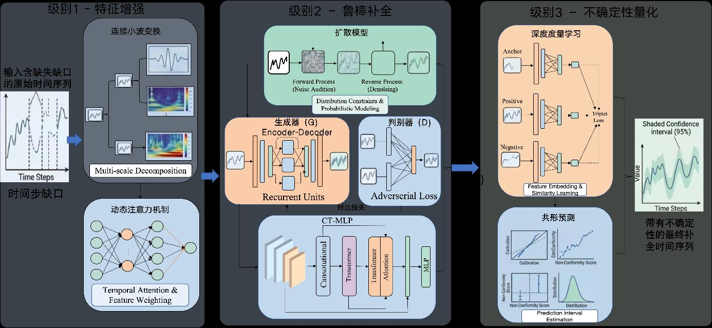
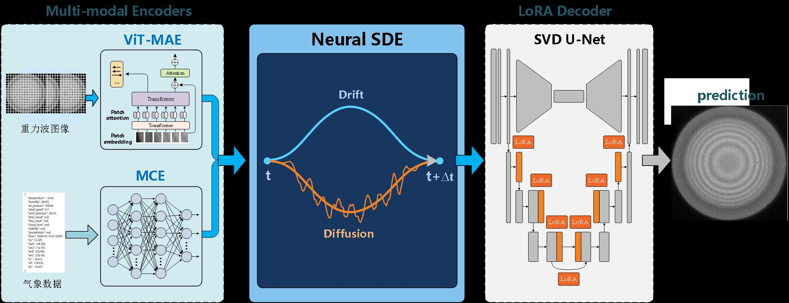

# §1.2 数据治理与异常处理

> 申报书章节：**§1.2 多模态质量数据综合治理及数据质量增强方法**（1.2.1–1.2.3） | 主要论文：[08]–[16]

---

## 1. 这个领域在学什么

原始质量数据往往**有噪声、有缺失、有异常、维度太高**。本领域学如何把脏数据变成**干净、完整、可建模**的数据集。

---

## 2. 核心概念

### 2.1 异常检测

- **3σ / IQR**：传统统计法，假设数据分布较「正常」——高维/偏态时易失效（论文 [10][11]）。
- **RANSAC**（[08]）：随机抽样拟合模型，内点外的为异常；适合回归型数据。
- **半监督异常检测**（[11]）：少量标签 + 大量无标签，适合标注 scarce 场景。
- **软阈值滑动窗口**（申报书）：局部动态阈值，比固定 3σ 更适应时序波动。

### 2.2 缺失数据补全

- **插值**：LOESS、多段插值（[09]），适合时间序列缺口。
- **模糊投票**（[09]）：多种方法投票决定修复值。
- **GAN / 扩散模型**（申报书）：生成式补全，适合复杂多模态缺失。

### 2.3 高维特征处理

- **稀疏表示**（[12][13]）：高维数据中只保留关键维度，降冗余。
- **Z-score 归一化**（申报书）：统一量纲，便于模型训练。

### 2.4 不确定性与先验

- **贝叶斯 + 马尔可夫**（[15]）：多源先验融合，小样本可靠性评估。
- **区间预测**（[16]）：不只给点估计，还给置信区间。
- **共形预测**（申报书）：有统计保证的不确定性区间。

---

## 3. 在本项目中的应用

| 申报书任务 | L2 方法 |
|---|---|
| 1.2.1 综合治理 | 特征筛选、异常检测、归一化、智能标注 |
| 1.2.2 缺失补全 | GAN+扩散、CWT、共形预测 |
| 1.2.3 时空扩散补全 | LoRA、Neural SDE、ViT-MAE |

### 3.1 图2：缺失补全三级架构（§1.2.2）

申报书将补全拆为三级：**特征增强**（CWT 多尺度 + 动态注意力）→ **鲁棒补全**（扩散模型分布约束 + GAN 对抗训练 + CT-MLP 对比损失）→ **不确定性量化**（度量学习 + 共形预测，输出 95% 置信区间）。这比单纯插值更能支撑后续风险决策对「补全可信度」的要求。

### 3.2 图3：时空扩散多模态预测（§1.2.3）

图像/波形走 **ViT-MAE** 掩码自编码器，表格/工况走 **MCE** 全连接编码器；融合后经 **Neural SDE** 建模漂移与扩散，再由 **SVD-U-Net + LoRA** 解码预测。适用于雷达图像质量数据与气象/环境多模态联合补全场景。

## 4. 相关论文

[08] RANSAC 清洗 · [09] 模糊投票插值 · [10] 鲁棒回归 · [11] 半监督异常 · [12] 层次稀疏聚类 · [13] 稀疏表示 · [15] 三态可靠性 · [16] ML 区间预测

（[14] 与 [13] 重复，不单独学习）

---

## 5. 推荐学习资源

- scikit-learn 异常检测：[https://scikit-learn.org/stable/modules/outlier_detection.html](https://scikit-learn.org/stable/modules/outlier_detection.html)
- pandas 缺失值处理文档
- 术语：RANSAC、LOESS、IQR、GAN → [01-术语词典](../01-术语词典.md)

---

## 6. 读完后应能回答

- 固定阈值异常检测为什么在装备时序数据上不够用？
- 插值补全和生成式补全各适合什么场景？
- 「不确定性量化」对后续风险预测有什么意义？

